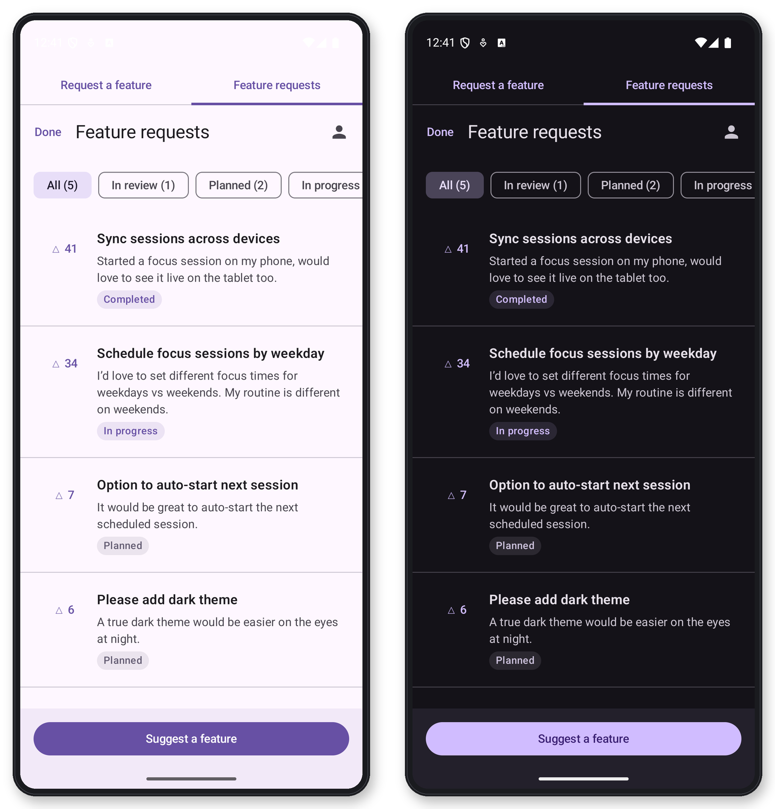

# FeedbackThread Android SDK

-3DDC84)


Native in-app feedback for Android: a drop-in Compose feature-request board with voting, a feedback form, and automatic **"Shipped in x.y.z"** badges — wired to your [FeedbackThread](https://feedbackthread.com) dashboard, roadmap, and AI-agent workflow.

- 🗳️ **Feature-request board** — moderated public requests with voting, status filters, and full detail views
- ✍️ **Feedback form** — bug reports and feature requests straight into your triage inbox
- 🚀 **Close the loop** — requests attached to a published release show a *Shipped in x.y.z* badge to the people who asked
- 💎 **Paying-customer signal** — optionally tag submissions and votes with your billing state for revenue-aware prioritization
- 🔒 **Privacy-first** — no email or name is required; you control whether to pass an external user identifier; anonymous voter IDs stay on-device
- 🪶 **Lean** — a coroutine client over `HttpURLConnection` + `kotlinx.serialization`, Compose screens, nothing else

## What your users see

`FeedbackThreadBoard` respects your Material 3 theme, light and dark:



## Requirements

- minSdk 26 (Android 8.0) · compileSdk 35
- Kotlin 2.1 · Jetpack Compose · JDK 17 toolchain

## Installation

The SDK is on Maven Central — no extra repository setup needed:

```kotlin
implementation("com.feedbackthread:feedbackthread-android:0.4.0")
```

Alternatively, publish locally from this repository:

```sh
./gradlew :feedbackthread:publishToMavenLocal   # then add mavenLocal() to your repositories
```

or consume it as a composite build in your app's `settings.gradle.kts`:

```kotlin
includeBuild("<path-to>/sdk/android") {
    dependencySubstitution {
        substitute(module("com.feedbackthread:feedbackthread-android"))
            .using(project(":feedbackthread"))
    }
}
```

A complete working consumer lives in [`example/`](./example).

## Quick start

Grab your project key from the dashboard (**SDK setup**). It's a public, low-privilege identifier — safe to ship in your APK. It can submit feedback, read the moderated request feed, and vote; it cannot touch your private dashboard data.

```kotlin
val feedbackThread = FeedbackThreadClient(projectKey = BuildConfig.FEEDBACKTHREAD_PROJECT_KEY)
```

Present `FeedbackThreadBoard` and you're done — it's the complete integration:

```kotlin
FeedbackThreadBoard(
    client = feedbackThread,
    externalUserId = signedInUserId,   // optional; anonymous ID used otherwise
    onAddRequest = { showFeedbackForm = true },   // present FeedbackThreadFeedbackScreen — see Advanced below
    onDismiss = onBack,
)
```

One screen gives users a vote-sorted board of requests and bugs with status filters (In review · Planned · In progress · Completed) and **Shipped in x.y.z** badges, a **Suggest a feature** button (wired to `onAddRequest`), and a **My requests** tab with an unread badge that closes the loop on their own cards — all built in. Only Android-visible requests appear.

### Tell FeedbackThread who pays

Pass the same signal you trust for your own paywall — it powers per-request "N paying customers want this" prioritization in the dashboard:

```kotlin
FeedbackThreadFeedbackSubmission(
    kind = FeedbackThreadFeedbackKind.REQUEST,
    title = "Add dark mode",
    text = "Would love a dark theme.",
    customerTier = if (billing.isPro) FeedbackThreadCustomerTier.Paying else FeedbackThreadCustomerTier.Free,
)
```

`FeedbackThreadCustomerTier` is `Free`, `Paying`, or `Custom("family")` — and omitted from the request entirely when left `null`.

## Advanced: standalone surfaces

`FeedbackThreadBoard` is a complete integration on its own, but its pieces are also available individually for contextual placements — e.g. a "Report a bug" row in your settings screen that jumps straight to the form instead of the full board. Each surface below is fully supported as a standalone screen.

### Show the feedback form

```kotlin
FeedbackThreadFeedbackScreen(
    client = feedbackThread,
    onDismiss = onBack,
)
```

Every submission carries an idempotency key, so a retried request never creates a duplicate.

### Show users their own requests

The board only ever shows moderated, public cards. `FeedbackThreadMyRequestsScreen` closes the loop for the person who submitted: it always shows their own cards, including ones still waiting for review that never appear anywhere public.

```kotlin
FeedbackThreadMyRequestsScreen(
    client = feedbackThread,
    onDismiss = onBack,
    externalUserId = signedInUserId,   // optional; falls back to the same anonymous ID as the board
    onUnreadCountChange = { unreadCount ->
        // badge your own UI, e.g. a bottom-nav item
    },
)
```

It groups cards into **Waiting for review**, **In progress**, and **Shipped**, and auto-acknowledges shipped cards as soon as they're viewed.

`onUnreadCountChange` only fires once the screen is opened — too late for a badge that should already be showing at launch. Call `myUpdates(externalUserId)` yourself on app start or foreground to get `unreadCount` ahead of time:

```kotlin
LaunchedEffect(Unit) {
    // Works for anonymous users too: feedbackThreadVoterId() returns the
    // SDK's persisted on-device ID when you don't pass your own.
    val userId = feedbackThreadVoterId(context, signedInUserId)
    runCatching { feedbackThread.myUpdates(userId) }
        .onSuccess { badgeCount = it.unreadCount }
}
```

The client exposes all three calls directly if you're building custom UI: `myRequests(externalUserId)`, `myUpdates(externalUserId)`, and `acknowledgeUpdates(ids, externalUserId)`.

### Use the client directly

The Compose screens are optional. `FeedbackThreadClient` exposes `submit(...)`, `requests(...)`, and `setVote(...)` for custom UI, with configurable connect/read timeouts and base-URL validation.

## Development

```sh
./gradlew :feedbackthread:testDebugUnitTest
./gradlew :feedbackthread:assembleDebug
./gradlew :feedbackthread:publishToMavenLocal
```

The opt-in live integration test runs when `FEEDBACKTHREAD_LIVE_BASE_URL` and `FEEDBACKTHREAD_LIVE_PROJECT_KEY` are set.

## How it fits together

The SDK is the in-app half of FeedbackThread: feedback lands in a keyboard-driven triage inbox, becomes cards on your roadmap, ships in tracked releases — and your AI agent can work the whole backlog over MCP. Learn more at [feedbackthread.com](https://feedbackthread.com).

## License

MIT — see [LICENSE](LICENSE).
